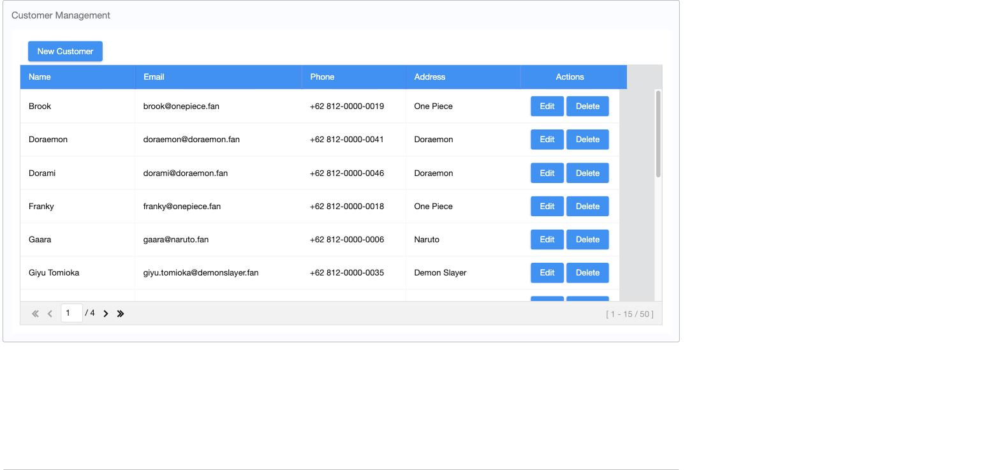
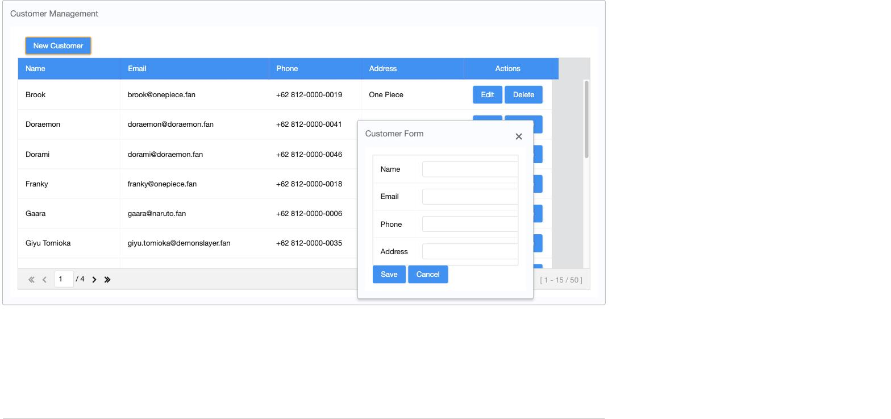

# spring-boot-zkoss1

A minimal CRUD demo showing how to build a server-side UI with [ZK Framework](https://www.zkoss.org/) on top of
Spring Boot, Spring Data JPA and an in-memory H2 database. The sample feature is a simple **Customer** management
screen: list, create, edit and delete customers, all through ZK's MVVM data binding.

## Tech Stack

- Java 25
- Spring Boot 4.0.5
- ZK Framework 10 (Jakarta) via `zkspringboot-starter`
- Spring Data JPA + Hibernate
- H2 (in-memory database)
- Lombok
- Gradle

## Prerequisites

- JDK 25
- No local database needed — H2 runs in-memory and resets on every restart

## Running the app

```bash
./gradlew bootRun
```

Then open [http://localhost:8080](http://localhost:8080) — the root path is mapped straight to the customer
list page. On first run, 50 sample customers are seeded automatically: anime characters from Naruto, One Piece,
Jujutsu Kaisen, Demon Slayer and Doraemon (10 from each series, with the series name stored in the Address field).

## Screenshots

**Customer list**



**Create / edit form**



## Project Structure

```
src/main/java/id/my/jvm/zkoosdemo1/
├── ZkoosDemo1Application.java        # Spring Boot entry point + sample data seeding
└── customer/
    ├── Customer.java                 # JPA entity
    ├── CustomerRepository.java       # Spring Data JPA repository
    ├── CustomerService.java          # Service layer used by the ViewModel
    └── CustomerViewModel.java        # ZK MVVM ViewModel (list/add/edit/delete)

src/main/resources/
├── application.properties            # ZK, datasource and JPA configuration
└── web/customer-list.zul             # ZK page: customer listbox + create/edit form
```

## Features

- List customers in a paged ZK `listbox`
- Create a new customer via a popup form
- Edit an existing customer in place
- Delete a customer with a confirmation dialog (ZK `Messagebox`)

## Build

```bash
./gradlew build
```

## Author

- [Hendi Santika](mailto:hendisantika@gmail.com)
- Telegram: [@hendisantika34](https://t.me/hendisantika34)
